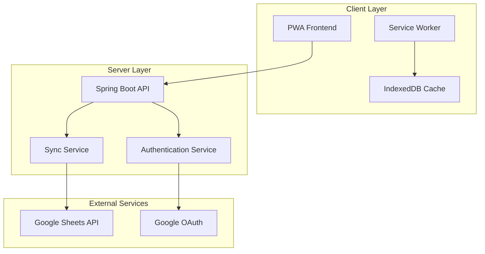

# Design Document: Expense Tracking System

## Overview

The Expense Tracking System is a Progressive Web Application (PWA) built with a Spring Boot backend and modern web frontend. The system provides comprehensive expense management with Google Sheets integration, hierarchical categorization, payment reminders, and visual analytics. The architecture follows a client-server model with offline-first PWA capabilities and real-time data synchronization.

## Architecture

### High-Level Architecture



### Technology Stack

**Backend:**
- Spring Boot 3.x with Java 17+
- Spring Web (REST API)
- Spring Security (Authentication)
- Google Sheets API v4
- H2 Database (for local caching and offline queue)

**Frontend:**
- Vanilla JavaScript ES6+ or React (lightweight PWA)
- Service Worker for offline functionality
- IndexedDB for client-side storage
- Chart.js for data visualization
- CSS Grid/Flexbox for responsive design

## Components and Interfaces

### Backend Components

#### 1. Expense Controller
```java
@RestController
@RequestMapping("/api/expenses")
public class ExpenseController {
    
    @PostMapping
    public ResponseEntity<Expense> createExpense(@RequestBody ExpenseRequest request);
    
    @GetMapping("/month/{year}/{month}")
    public ResponseEntity<List<Expense>> getExpensesByMonth(@PathVariable int year, @PathVariable int month);
    
    @GetMapping("/categories")
    public ResponseEntity<List<Category>> getCategories();
    
    @PutMapping("/{id}")
    public ResponseEntity<Expense> updateExpense(@PathVariable Long id, @RequestBody ExpenseRequest request);
    
    @DeleteMapping("/{id}")
    public ResponseEntity<Void> deleteExpense(@PathVariable Long id);
}
```

#### 2. Google Sheets Service
```java
@Service
public class GoogleSheetsService {
    
    public void syncExpenseToSheet(Expense expense);
    public List<Expense> getExpensesFromSheet(int year, int month);
    public void createMonthlySheet(int year, int month);
    public void updateExpenseInSheet(Expense expense);
    public boolean isConnected();
}
```

#### 3. Sync Service
```java
@Service
public class SyncService {
    
    @Async
    public CompletableFuture<Void> syncPendingChanges();
    
    public void queueForSync(SyncOperation operation);
    public SyncStatus getSyncStatus();
    public void handleSyncConflict(Expense local, Expense remote);
}
```

#### 4. Payment Reminder Service
```java
@Service
public class PaymentReminderService {
    
    @Scheduled(fixedRate = 3600000) // Check every hour
    public void checkDuePayments();
    
    public void createReminder(PaymentReminder reminder);
    public List<PaymentReminder> getUpcomingReminders();
    public void markReminderAsPaid(Long reminderId);
    public void scheduleCustomNotification(Long reminderId, LocalDateTime notificationTime);
    public void updateReminderPreferences(Long reminderId, ReminderPreferences preferences);
}
```

### Frontend Components

#### 1. Expense Entry Component
```javascript
class ExpenseEntry {
    constructor() {
        this.categoryService = new CategoryService();
        this.expenseService = new ExpenseService();
    }
    
    async submitExpense(expenseData) {
        // Validate input
        // Submit to API or queue for offline sync
        // Update UI
    }
    
    loadCategories() {
        // Load hierarchical categories
        // Populate dropdown/tree view
    }
}
```

#### 2. Analytics Dashboard
```javascript
class AnalyticsDashboard {
    constructor() {
        this.chartRenderer = new ChartRenderer();
    }
    
    async loadMonthlyData(year, month) {
        // Fetch expense data
        // Generate charts and summaries
    }
    
    renderCategoryBreakdown(expenses) {
        // Create pie chart for categories
        // Show hierarchical breakdown
    }
}
```

#### 3. Service Worker
```javascript
// sw.js
self.addEventListener('sync', event => {
    if (event.tag === 'expense-sync') {
        event.waitUntil(syncPendingExpenses());
    }
});

self.addEventListener('fetch', event => {
    // Cache-first strategy for app shell
    // Network-first for API calls with fallback
});
```

## Data Models

### Core Entities

#### Expense Entity
```java
@Entity
public class Expense {
    @Id
    @GeneratedValue(strategy = GenerationType.IDENTITY)
    private Long id;
    
    @Column(nullable = false)
    private BigDecimal amount;
    
    @Column(nullable = false)
    private LocalDate date;
    
    @ManyToOne
    @JoinColumn(name = "category_id")
    private Category category;
    
    private String description;
    private LocalDateTime createdAt;
    private LocalDateTime updatedAt;
    private boolean synced;
    
    // Getters, setters, constructors
}
```

#### Category Entity
```java
@Entity
public class Category {
    @Id
    @GeneratedValue(strategy = GenerationType.IDENTITY)
    private Long id;
    
    @Column(nullable = false, unique = true)
    private String name;
    
    @ManyToOne
    @JoinColumn(name = "parent_id")
    private Category parent;
    
    @OneToMany(mappedBy = "parent", cascade = CascadeType.ALL)
    private List<Category> subcategories = new ArrayList<>();
    
    private String color; // For UI visualization
    
    // Getters, setters, constructors
}
```

#### Payment Reminder Entity
```java
@Entity
public class PaymentReminder {
    @Id
    @GeneratedValue(strategy = GenerationType.IDENTITY)
    private Long id;
    
    @Column(nullable = false)
    private String name;
    
    @Column(nullable = false)
    private BigDecimal amount;
    
    @Column(nullable = false)
    private LocalDate dueDate;
    
    @Enumerated(EnumType.STRING)
    private ReminderFrequency frequency; // MONTHLY, QUARTERLY, YEARLY
    
    @ManyToOne
    @JoinColumn(name = "category_id")
    private Category category;
    
    private boolean active;
    private LocalDate lastPaid;
    
    // User-configurable notification preferences
    private Integer daysBefore; // How many days before due date to notify (default: 3)
    private LocalTime preferredNotificationTime; // User's preferred time (default: 9:00 AM)
    private boolean enableEmailNotification;
    private boolean enablePushNotification;
    private String customMessage; // Optional custom reminder message
    
    // Getters, setters, constructors
}
```

#### Reminder Preferences Entity
```java
@Entity
public class ReminderPreferences {
    @Id
    @GeneratedValue(strategy = GenerationType.IDENTITY)
    private Long id;
    
    @OneToOne
    @JoinColumn(name = "reminder_id")
    private PaymentReminder reminder;
    
    private Integer daysBefore; // 1-30 days before due date
    private LocalTime notificationTime; // User's preferred time
    private boolean weekendsOnly; // Only notify on weekends
    private boolean weekdaysOnly; // Only notify on weekdays
    private Set<DayOfWeek> specificDays; // Specific days of week
    
    // Getters, setters, constructors
}
```

### Google Sheets Schema

Each month will have a dedicated sheet with the following columns:
- Date (YYYY-MM-DD)
- Amount (Decimal)
- Category (String)
- Subcategory (String, optional)
- Description (String)
- Created At (Timestamp)
- Updated At (Timestamp)

## Error Handling

### Backend Error Handling
```java
@ControllerAdvice
public class GlobalExceptionHandler {
    
    @ExceptionHandler(GoogleSheetsException.class)
    public ResponseEntity<ErrorResponse> handleGoogleSheetsError(GoogleSheetsException e) {
        // Queue operation for retry
        // Return appropriate error response
    }
    
    @ExceptionHandler(ValidationException.class)
    public ResponseEntity<ErrorResponse> handleValidationError(ValidationException e) {
        // Return validation error details
    }
}
```

### Frontend Error Handling
```javascript
class ErrorHandler {
    static async handleApiError(error) {
        if (error.status === 0) {
            // Network error - queue for offline sync
            await OfflineQueue.add(error.request);
        } else if (error.status >= 500) {
            // Server error - show retry option
            NotificationService.showRetryableError(error.message);
        }
    }
}
```

## Testing Strategy

The testing approach combines unit tests for specific functionality and property-based tests for universal correctness properties.

### Unit Testing
- **Spring Boot Tests**: Test controllers, services, and repositories
- **Frontend Tests**: Test components, services, and utilities
- **Integration Tests**: Test API endpoints and Google Sheets integration
- **PWA Tests**: Test service worker functionality and offline capabilities

### Property-Based Testing
Property-based tests will validate universal properties using JUnit 5 with jqwik for Java backend testing.

**Configuration**: Each property test runs minimum 100 iterations with random input generation.

## Correctness Properties

*A property is a characteristic or behavior that should hold true across all valid executions of a system-essentially, a formal statement about what the system should do. Properties serve as the bridge between human-readable specifications and machine-verifiable correctness guarantees.*

### Property 1: Expense Data Persistence
*For any* valid expense with date, amount, category, subcategory, and description, storing the expense should result in all fields being retrievable with identical values.
**Validates: Requirements 1.1**

### Property 2: Category Hierarchy Display
*For any* category with subcategories, selecting that category should display all and only its direct subcategories.
**Validates: Requirements 1.2**

### Property 3: Monthly Expense Organization
*For any* set of expenses across different months, viewing expenses should group them correctly by month with proper category hierarchy maintained within each month.
**Validates: Requirements 1.3**

### Property 4: Google Sheets Sync Timing
*For any* newly created expense, the sync operation to Google Sheets should complete within 5 seconds under normal network conditions.
**Validates: Requirements 2.2**

### Property 5: Expense Modification Sync
*For any* expense modification, the corresponding Google Sheets entry should reflect the same changes immediately after sync completion.
**Validates: Requirements 2.3**

### Property 6: Offline Queue Behavior
*For any* expense operation performed while offline, the operation should be queued locally and executed when connectivity is restored.
**Validates: Requirements 2.4**

### Property 7: Monthly Sheet Organization
*For any* expense with a specific date, it should be stored in the Google Sheets tab corresponding to that month and year.
**Validates: Requirements 2.5**

### Property 8: Reminder Scheduling
*For any* recurring expense setup, the system should create reminder entries with the correct frequency and due dates.
**Validates: Requirements 3.1**

### Property 9: Notification Timing
*For any* payment reminder with a due date, a notification should be triggered exactly 3 days before the due date.
**Validates: Requirements 3.2**

### Property 10: Reminder Content Completeness
*For any* triggered reminder, the notification should contain the expense name, amount, and due date.
**Validates: Requirements 3.3**

### Property 11: Reminder to Expense Conversion
*For any* reminder marked as paid, a corresponding expense record should be created with matching details.
**Validates: Requirements 3.4**

### Property 12: Offline Functionality
*For any* expense creation or viewing operation, the PWA should function correctly when network connectivity is unavailable.
**Validates: Requirements 4.2**

### Property 13: Automatic Sync on Reconnection
*For any* offline changes, when internet connectivity is restored, all pending changes should automatically sync to Google Sheets.
**Validates: Requirements 4.3**

### Property 14: Data Caching
*For any* essential application data, it should be cached locally and available for offline viewing.
**Validates: Requirements 4.5**

### Property 15: Monthly Trend Visualization
*For any* set of expenses across multiple months, the analytics page should display accurate monthly trend data.
**Validates: Requirements 5.1**

### Property 16: Category Breakdown Accuracy
*For any* selected month with expenses, the category-wise breakdown should show correct totals for each category.
**Validates: Requirements 5.2**

### Property 17: Hierarchical Category Totals
*For any* hierarchical category structure, parent category totals should equal the sum of all subcategory amounts.
**Validates: Requirements 6.5**

### Property 18: API CRUD Completeness
*For any* expense entity, all CRUD operations (create, read, update, delete) should be available through RESTful endpoints.
**Validates: Requirements 7.1**

### Property 19: Input Validation
*For any* incoming expense data, invalid data should be rejected with appropriate error messages, while valid data should be processed successfully.
**Validates: Requirements 7.4**

### Property 20: Connectivity-Based Sync
*For any* change in internet connectivity status, the system should automatically trigger sync operations when connectivity is detected.
**Validates: Requirements 9.1**

### Property 21: Conflict Resolution by Timestamp
*For any* sync conflict between local and remote data, the entry with the most recent timestamp should take precedence.
**Validates: Requirements 9.2**

### Property 22: Exponential Backoff Retry
*For any* failed sync operation, the system should retry up to 5 times with exponential backoff intervals.
**Validates: Requirements 9.3**

### Property 23: Sync Status Display
*For any* ongoing sync operation, the user interface should display the current sync status.
**Validates: Requirements 9.5**

## Testing Strategy

### Dual Testing Approach
The system will use both unit tests and property-based tests to ensure comprehensive coverage:

- **Unit tests**: Verify specific examples, edge cases, and error conditions
- **Property tests**: Verify universal properties across all inputs
- Both approaches are complementary and necessary for complete validation

### Property-Based Testing Configuration
- **Framework**: jqwik for Java backend, fast-check for JavaScript frontend
- **Iterations**: Minimum 100 iterations per property test
- **Tagging**: Each test tagged with format: **Feature: expense-tracking, Property {number}: {property_text}**

### Unit Testing Focus Areas
- Google Sheets API integration points
- Authentication and authorization flows
- Error handling and edge cases
- PWA service worker functionality
- Specific UI component behaviors

### Integration Testing
- End-to-end expense creation and sync workflows
- Offline-to-online transition scenarios
- Cross-browser PWA functionality
- Google Sheets API rate limiting and error handling

The testing strategy ensures both functional correctness through property-based testing and practical reliability through comprehensive unit and integration tests.