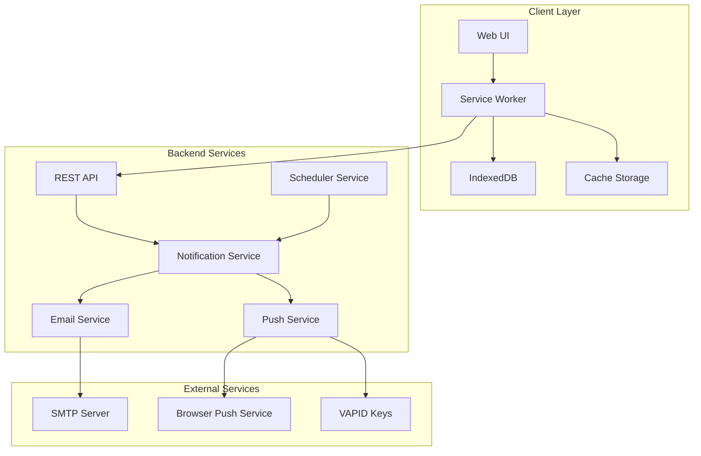
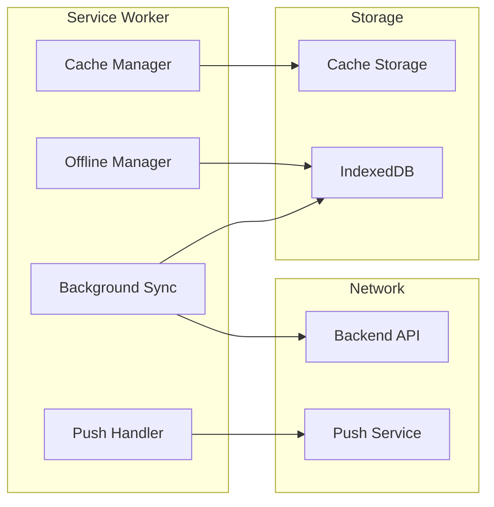

# Design Document

## Overview

This design transforms the existing expense tracking application into a comprehensive Progressive Web Application (PWA) with fully functional notification systems, robust offline capabilities, and native app-like features. The enhancement addresses the current broken notification system by implementing proper push notification infrastructure, email services, and advanced PWA features including background sync and offline storage.

The design builds upon the existing Spring Boot backend and vanilla JavaScript frontend, adding new services, enhanced service worker capabilities, and improved user experience features while maintaining backward compatibility.

## Architecture

### High-Level Architecture



### Service Worker Architecture



## Components and Interfaces

### 1. Enhanced Service Worker

**Purpose**: Manages offline functionality, background sync, push notifications, and caching strategies.

**Key Features**:
- Advanced caching with cache-first and network-first strategies
- Background sync for offline expense entries
- Push notification handling with action buttons
- Offline data management using IndexedDB
- Automatic cache updates and version management

**Interface**:
```javascript
// Service Worker Events
self.addEventListener('install', installHandler);
self.addEventListener('activate', activateHandler);
self.addEventListener('fetch', fetchHandler);
self.addEventListener('push', pushHandler);
self.addEventListener('sync', syncHandler);
self.addEventListener('notificationclick', notificationClickHandler);

// Background Sync Registration
self.registration.sync.register('expense-sync');
self.registration.sync.register('analytics-sync');
```

### 2. Push Notification Service (Backend)

**Purpose**: Handles server-side push notification delivery using VAPID authentication.

**Key Features**:
- VAPID key management and JWT token generation
- Push subscription management
- Rich notification payloads with action buttons
- Retry logic with exponential backoff
- Integration with existing notification entities

**Interface**:
```java
@Service
public class PushNotificationService {
    public void sendPushNotification(PushSubscription subscription, NotificationPayload payload);
    public void subscribeUser(PushSubscriptionRequest request);
    public void unsubscribeUser(String endpoint);
    public void sendBulkNotifications(List<PushSubscription> subscriptions, NotificationPayload payload);
}
```

### 3. Email Notification Service

**Purpose**: Sends formatted HTML email notifications using JavaMailSender.

**Key Features**:
- HTML email templates using Thymeleaf
- SMTP configuration with authentication
- Email scheduling and retry mechanisms
- Rich email content with charts and summaries
- Unsubscribe link management

**Interface**:
```java
@Service
public class EmailNotificationService {
    public void sendDailyReminder(String email, DailyReminderData data);
    public void sendWeeklySummary(String email, WeeklySummaryData data);
    public void sendBudgetAlert(String email, BudgetAlertData data);
    public void sendCustomReminder(String email, CustomReminderData data);
}
```

### 4. Offline Storage Manager (Frontend)

**Purpose**: Manages offline data storage and synchronization using IndexedDB.

**Key Features**:
- Expense entry queuing for offline mode
- Conflict resolution for sync operations
- Data encryption for sensitive information
- Storage quota management
- Sync status tracking

**Interface**:
```javascript
class OfflineStorageManager {
    async storeExpense(expense);
    async getPendingExpenses();
    async markExpenseAsSynced(expenseId);
    async resolveConflict(localExpense, serverExpense);
    async clearSyncedData();
}
```

### 5. Background Sync Manager

**Purpose**: Handles automatic synchronization of offline data when connectivity is restored.

**Key Features**:
- Automatic retry with exponential backoff
- Batch processing of pending operations
- Conflict detection and resolution
- Progress tracking and user feedback
- Error handling and logging

**Interface**:
```javascript
class BackgroundSyncManager {
    async registerSync(tag);
    async processExpenseSync();
    async processAnalyticsSync();
    async handleSyncFailure(error);
    async getQueueStatus();
}
```

### 6. PWA Install Manager

**Purpose**: Manages PWA installation prompts and app lifecycle.

**Key Features**:
- Install prompt timing and display logic
- App update notifications
- Installation analytics
- Custom install UI
- Platform-specific optimizations

**Interface**:
```javascript
class PWAInstallManager {
    async showInstallPrompt();
    async handleInstallEvent();
    async checkForUpdates();
    async notifyUpdateAvailable();
    isInstalled();
}
```

## Data Models

### Push Subscription Entity

```java
@Entity
@Table(name = "push_subscriptions")
public class PushSubscription {
    @Id
    @GeneratedValue(strategy = GenerationType.IDENTITY)
    private Long id;
    
    @Column(unique = true, nullable = false)
    private String endpoint;
    
    @Column(nullable = false)
    private String p256dhKey;
    
    @Column(nullable = false)
    private String authKey;
    
    @Column(nullable = false)
    private String userAgent;
    
    @CreationTimestamp
    private LocalDateTime createdAt;
    
    @UpdateTimestamp
    private LocalDateTime updatedAt;
    
    private boolean active = true;
}
```

### Offline Expense Entry

```javascript
// IndexedDB Schema
const offlineExpenseSchema = {
    id: 'string', // UUID for offline entries
    amount: 'number',
    description: 'string',
    categoryId: 'number',
    date: 'string', // ISO date string
    tags: 'array',
    receipt: 'blob', // Optional receipt image
    createdAt: 'string',
    syncStatus: 'string', // 'pending', 'syncing', 'synced', 'failed'
    retryCount: 'number',
    lastRetryAt: 'string'
};
```

### Email Template Data

```java
public class EmailTemplateData {
    @Data
    public static class DailyReminderData {
        private String userName;
        private LocalDate date;
        private int streakDays;
        private double monthlyBudget;
        private double currentSpending;
        private String topCategory;
    }
    
    @Data
    public static class WeeklySummaryData {
        private String userName;
        private LocalDate weekStart;
        private LocalDate weekEnd;
        private double totalSpent;
        private Map<String, Double> categoryBreakdown;
        private List<Expense> topExpenses;
        private String chartImageUrl;
    }
    
    @Data
    public static class BudgetAlertData {
        private String userName;
        private double budgetAmount;
        private double currentSpending;
        private double percentage;
        private String alertType; // 'warning' or 'exceeded'
        private List<String> topCategories;
    }
}
```

## Correctness Properties

*A property is a characteristic or behavior that should hold true across all valid executions of a system-essentially, a formal statement about what the system should do. Properties serve as the bridge between human-readable specifications and machine-verifiable correctness guarantees.*

### Property 1: Push Notification Permission and Subscription Management
*For any* user action to enable push notifications, the system should request browser permission and store the subscription if granted
**Validates: Requirements 1.1**

### Property 2: Multi-Channel Notification Delivery
*For any* scheduled notification and user preference configuration, the system should send notifications through all enabled channels (push, email, in-app)
**Validates: Requirements 1.2**

### Property 3: Immediate Budget Alert Delivery
*For any* budget threshold exceeded scenario, the system should immediately send alert notifications through all enabled channels
**Validates: Requirements 1.3**

### Property 4: Graceful Permission Fallback
*For any* push notification permission denial, the system should automatically fall back to email notifications without user intervention
**Validates: Requirements 1.4**

### Property 5: Offline Expense Storage
*For any* expense entry made while offline, the system should store the data in IndexedDB and mark it for sync
**Validates: Requirements 2.1**

### Property 6: Background Sync Round Trip
*For any* offline expense entry, when connectivity is restored, background sync should upload the data and the expense should appear in the server database
**Validates: Requirements 2.2**

### Property 7: Offline Cache Display
*For any* offline state, the system should display cached analytics and reports from the most recent successful sync
**Validates: Requirements 2.3**

### Property 8: PWA Install Prompt Display
*For any* user session where PWA criteria are met, the system should show an install prompt to eligible users who haven't already installed
**Validates: Requirements 3.1**

### Property 9: Notification Action Button Functionality
*For any* payment reminder notification, the system should display "Mark as Paid" and "Snooze" action buttons that perform their respective functions
**Validates: Requirements 4.1, 4.2, 4.3**

### Property 10: Background Sync Queue Management
*For any* offline expense addition, the background sync system should queue the expense and process it when connectivity is restored
**Validates: Requirements 5.1**

### Property 11: Exponential Backoff Retry Pattern
*For any* sync failure due to server errors, the system should retry with exponentially increasing delays (1s, 2s, 4s, 8s, etc.)
**Validates: Requirements 5.3**

### Property 12: Cache-First Resource Loading
*For any* app load request, the service worker should serve cached resources first for instant loading, then update from network if available
**Validates: Requirements 6.1**

### Property 13: API Response Caching
*For any* successful API response, the system should cache the response data for offline access
**Validates: Requirements 6.2**

### Property 14: Email Notification Scheduling
*For any* enabled email notification preference, the system should send emails at the user's specified preferred time
**Validates: Requirements 7.1**

### Property 15: Notification Channel Preference Enforcement
*For any* disabled notification channel, the system should not send notifications through that channel regardless of notification type
**Validates: Requirements 8.3**

### Property 16: Performance Load Time Requirement
*For any* app load on simulated 3G connection, the main interface should be displayed within 2 seconds
**Validates: Requirements 9.1**

### Property 17: Offline Data Encryption
*For any* sensitive data stored offline, the system should encrypt it using the Web Crypto API before storing in IndexedDB
**Validates: Requirements 10.1**

### Property 18: VAPID Authentication for Push Notifications
*For any* push notification sent, the system should use VAPID keys for secure authentication with the browser push service
**Validates: Requirements 10.2**

### Property 19: Permission Revocation Cleanup
*For any* user permission revocation, the system should immediately stop related functionality and clear all associated stored data
**Validates: Requirements 10.5**

## Error Handling

### Push Notification Errors
- **Permission Denied**: Gracefully fall back to email notifications and update user preferences
- **Subscription Invalid**: Remove invalid subscriptions and prompt for re-subscription
- **Network Timeout**: Queue notifications for retry with exponential backoff
- **VAPID Key Issues**: Log errors and fall back to in-app notifications

### Email Service Errors
- **SMTP Connection Failed**: Retry with exponential backoff, log errors for monitoring
- **Invalid Email Address**: Skip invalid addresses and log for user correction
- **Template Rendering Failed**: Use plain text fallback and log template errors
- **Rate Limiting**: Implement queue management and respect rate limits

### Offline Storage Errors
- **IndexedDB Quota Exceeded**: Implement LRU eviction and notify user of storage limits
- **Encryption Failures**: Fall back to unencrypted storage with user consent
- **Sync Conflicts**: Present resolution UI and preserve user data
- **Corruption Detection**: Clear corrupted data and re-sync from server

### Service Worker Errors
- **Cache Failures**: Serve from network and log cache issues
- **Background Sync Failures**: Retry with exponential backoff and user notification
- **Update Failures**: Notify user and provide manual refresh option
- **Resource Loading Errors**: Serve cached fallbacks and log missing resources

### PWA Installation Errors
- **Manifest Issues**: Validate manifest and provide fallback installation
- **Icon Loading Failures**: Use default icons and log missing resources
- **Platform Incompatibility**: Gracefully degrade features and inform user
- **Storage Permission Denied**: Limit offline features and inform user

## Testing Strategy

### Dual Testing Approach

This feature requires both **unit tests** and **property-based tests** to ensure comprehensive coverage:

**Unit Tests** focus on:
- Specific notification scenarios and edge cases
- Email template rendering with sample data
- Service worker event handling
- PWA installation flow steps
- Error handling for specific failure modes

**Property-Based Tests** focus on:
- Universal properties across all notification types and user preferences
- Offline storage and sync behavior across various data scenarios
- Cache management across different resource types and sizes
- Security properties across all data handling operations
- Performance characteristics across different network conditions

### Property-Based Testing Configuration

**Testing Framework**: Use **fast-check** for JavaScript property tests and **jqwik** for Java property tests

**Test Configuration**:
- Minimum **100 iterations** per property test
- Each property test references its design document property
- Tag format: **Feature: pwa-notifications-enhancement, Property {number}: {property_text}**

**Key Test Generators**:
- **Notification Preferences**: Generate random combinations of enabled/disabled channels
- **Offline Scenarios**: Generate various network connectivity patterns
- **User Data**: Generate realistic expense entries, categories, and amounts
- **Time Scenarios**: Generate different scheduling times and time zones
- **Error Conditions**: Generate various failure modes and recovery scenarios

### Integration Testing

**Service Worker Testing**:
- Test service worker lifecycle events
- Verify background sync functionality
- Test push notification handling
- Validate cache strategies

**Email Service Testing**:
- Test SMTP connectivity and authentication
- Verify HTML template rendering
- Test email delivery and retry logic
- Validate unsubscribe functionality

**PWA Feature Testing**:
- Test installation prompts and flow
- Verify offline functionality
- Test app update mechanisms
- Validate manifest and icon loading

### Performance Testing

**Load Time Testing**:
- Measure app load times on various connection speeds
- Test cache effectiveness for repeat visits
- Verify service worker performance impact

**Offline Performance**:
- Test IndexedDB performance with large datasets
- Measure background sync processing time
- Verify memory usage during offline operations

**Notification Performance**:
- Test push notification delivery times
- Measure email sending performance
- Verify batch notification processing